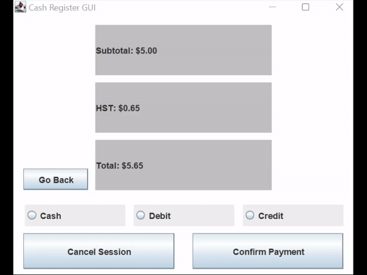

# Cash Register GUI

### How To Run
Download all files into the same folder, open all files, compile Test.java

### Starting Session, Adding Items, Removing Items

### Selecting Payment Option, Ending Session

### Receipt
Receipt Gets Printed in Terminal

#### Group Members: Calla Wilson, Vishan Patel, SuryaTeja Gorthi
